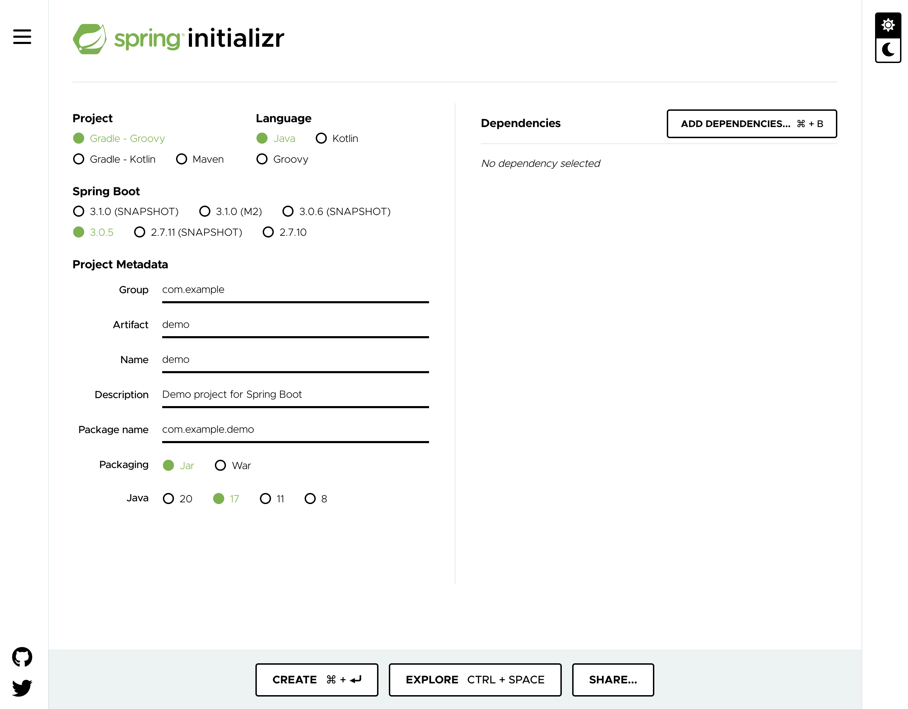

The first thing we need to do is create a Spring Boot application. To do this we are going to to use the Spring Initializr web site.



The purpose of the Spring Initializr web site is to allow you to enter in details about the Spring Boot application you want to create. This includes the name of the application, the tooling you want to use, and any dependencies. When you click on generate it will automatically start a download of application source code for a Spring Boot application satisfying those requirements. You can then unpack that on your local computer and start working.

Normally to do this you would go to [start.spring.io](https://start.spring.io/), however for this workshop we have integrated the web site into a tab of the workshop session dashboard. This is done so that rather than downloading the Spring Boot application you create with it to your own local machine, it will download it into the workshop environment.

Select the **Initializr** tab in the workshop session dashboard.

```dashboard:open-dashboard
name: Initializr
```

For this workshop environment you must ensure Java 17 is selected under the project metadata on Spring Initializr.

Because of later commands we will run, we also want to generate a Maven project rather Gradle, so click on **Maven** under the **Project** category to select it.

You can leave as is the other defaults for the project metadata as the workshop is scripted to already expect the project name to be `demo`.

Now click on **Add Dependencies**, search for `Spring Reactive Web`{{copy}} and add it.

Click again on **Add Dependencies** and this time search for `Spring Boot Actuator`{{copy}} and add it.

We are ready to generate the Spring Boot application code. Remember you need to be using the Spring Initializr integrated into the workshop session dashboard.

Click on **Create**.

This should send you back to the terminal and you can see where the Spring Boot application was downloaded and extracted into the workshop environment.

You can see the result by running:

```terminal:execute
command: tree demo
```

To verify that the application code has been generated successfully, open up the main Java source code file for the application.

```editor:open-file
file: ~/exercises/demo/src/main/java/com/example/demo/DemoApplication.java
```
